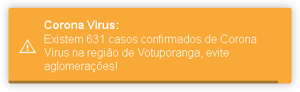

# COVID-19
Active notifications on your site about Corona Virus cases on Brazil.

Put a notification like someone who enters your site:

The data is changed according to the region where the user accesses the site.

<h1>API used to obtain COVID-19 information:</h1>
https://covid19-brazil-api.now.sh/api/report/v1/brazil/

<h1>API used to obtain client information:</h1>
http://ipinfo.io/
